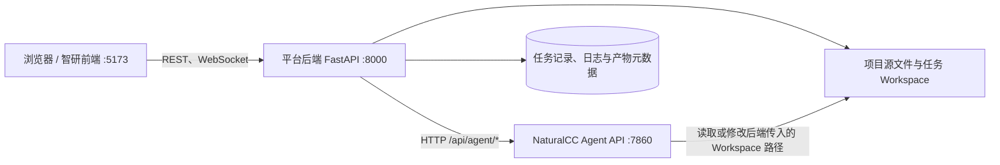

# Windows 本机部署指南

本文说明如何在一台 Windows 开发机上启动当前后端、NaturalCC 和智研前端，解释进程间如何连接，以及每个工具的职责。内容依据当前三个代码目录与配置编写；本指南不代表 openEuler 部署已经验证。

## 1. 当前部署形态

推荐把三个 Git 仓库作为 `O:\Code` 下的并列项目保留：

| 组件 | 当前目录 | 运行时 | 本机地址 |
| --- | --- | --- | --- |
| 后端平台（FastAPI） | `O:\Code\resource-co-debug-platform-backend` | Python 3.11、Uvicorn | `http://127.0.0.1:8000` |
| NaturalCC Agent API | `O:\Code\naturalcc-cs` | Python 3.12、Uvicorn | `http://127.0.0.1:7860` |
| 智研前端（Vue 3 + Vite） | `O:\Code\resource-co-debug-platform-zhiyan-frontend` | Node.js、npm、Vite | `http://127.0.0.1:5173` |

不要把 NaturalCC 放进后端仓库内部。它有独立的 Python 版本、依赖和发布节奏；保持并列目录可让它们分别更新，也避免后端虚拟环境把两个服务的依赖混在一起。



前端只请求平台后端；它不直接请求 NaturalCC。后端创建项目任务 Workspace 后，将该目录的绝对路径交给 NaturalCC，NaturalCC 在该 Workspace 中执行 Agent 工作。因此本机联调时，后端和 NaturalCC 必须运行在同一台 Windows 主机并能访问同一目录。若以后拆到不同主机或容器，光有 HTTP 网络连通还不够，必须额外挂载双方可见且路径约定一致的共享卷。

## 2. 用哪个软件

- **PyCharm：**打开 `resource-co-debug-platform-backend`，选择现有 Python 3.11 解释器。主要用于后端导航、断点和查看 FastAPI 代码。
- **VS Code：**适合同时打开 NaturalCC 与 Vue 前端，安装 Python、Vue/TypeScript 扩展即可。服务仍从集成终端启动。
- **HBuilderX：**这个前端仓库是标准 Vue + Vite Web 项目，不是 uni-app 工程；它可以用于查看和编辑，但不是运行它的必要条件。推荐由 VS Code 终端运行 Vite，再用浏览器访问。
- **IntelliJ IDEA：**不是 Python 服务的首选；如果你习惯用它看 Java、脚本或多个仓库，可以保留，但不需要额外配置它来启动这三个服务。
- **Visual Studio 2022：**不负责 FastAPI 或 Vite。它可用于 MSVC/C++ 开发；MSVC 与 GCC/GDB 是不同工具链，不能据此认定 B 模块在 openEuler 上的 GCC/GDB 流程已验证。
- **Windows Terminal / PowerShell：**用三个独立终端窗口分别运行后端、NaturalCC、前端。关闭对应窗口即可停止该开发服务。

## 3. 当前可复用的本机依赖

本机已发现以下解释器与工具版本：

| 用途 | 已存在路径 / 版本 |
| --- | --- |
| 后端 Python | `O:\Code_dependency\python_envs\resource-co-debug-py311\Scripts\python.exe`，Python 3.11.9 |
| NaturalCC Python | `O:\Code_dependency\python_envs\naturalcc-code-agent-py312\Scripts\python.exe`，Python 3.12.14 |
| libclang | `O:\Code_dependency\tools\libclang-18.1.1\clang\native\libclang.dll` |
| Node.js / npm | Node.js 24.13.0、npm 11.6.2 |
| 前端依赖 | 前端仓库已有 `node_modules` |

解释器按项目隔离：后端声明 `Python >=3.11,<3.12`；NaturalCC `code_agent` 声明 `Python >=3.12,<3.13`。不要用一个解释器安装两边的依赖，也不要把 NaturalCC 的大型模型/研究依赖装进后端环境。

这里存在两种容易混淆的依赖目录：仓库现有脚本和已经配置好的环境使用 `O:\Code_dependency`；团队当前共享依赖规范目录写作 `O:\Code\_dependency`。它们是两个不同路径。本机部署沿用已存在、并已由仓库启动脚本引用的环境，不要因为目录名不同而重复安装；新依赖的存放应遵循团队当前依赖规范并先确认项目脚本指向。

## 4. 第一次启动前

### 4.1 确认代码目录

确认以下目录存在且是你希望联调的工作副本：

```powershell
Test-Path 'O:\Code\resource-co-debug-platform-backend'
Test-Path 'O:\Code\naturalcc-cs'
Test-Path 'O:\Code\resource-co-debug-platform-zhiyan-frontend'
```

NaturalCC README 将 `code_agent` 作为 Agent 服务实现，`ncc` 是它复用的 NaturalCC 代码解析/研究能力。当前后端接入的是 `code_agent` 的 Agent API，不是通过导入 `ncc` Python 包，也不是通过运行 NaturalCC 自带的 Web 前端来接入。

### 4.2 后端配置

后端从仓库根目录读取 `.env`（配置定义在 `app/core/config.py`）。如尚无本机 `.env`，可复制模板：

```powershell
Set-Location 'O:\Code\resource-co-debug-platform-backend'
if (-not (Test-Path .env)) { Copy-Item .env.example .env }
```

本机默认值已适用于下列组合：

```dotenv
APP_HOST=0.0.0.0
APP_PORT=8000
STORAGE_ROOT=data/workspaces
NATURALCC_BASE_URL=http://127.0.0.1:7860
NATURALCC_APPROVE_EXECUTE=false
```

`STORAGE_ROOT` 是项目上传、源文件和任务 Workspace 的根目录；任务 SQLite 默认放在该目录的父目录下。相对路径以启动后端时的仓库根目录为基准。当前开发启动脚本会自动切到该根目录，因此默认数据落在后端仓库的 `data` 下。需要把运行数据与源码分开时，可以在本机 `.env` 中将其改为专用绝对目录，例如 `O:\Code\_runtime\resource-co-debug-platform\workspaces`；该目录会在后端启动时创建。`.env` 和运行数据不要提交到 Git。

NaturalCC 模型密钥只交给 NaturalCC 进程，不填入后端 `.env`、前端 `VITE_*` 变量、HTTP 请求或项目文档。`NATURALCC_APPROVE_EXECUTE=false` 保持默认值；它限制 Agent 的 execute 风险操作。不要为了让服务启动而改成 `true`，特别是 NaturalCC 能执行项目命令而主机没有操作系统沙箱时。

### 4.3 NaturalCC 依赖与模型配置

当前已配置的 Python 3.12 环境与 libclang 可以复用。代码生成（Agent）需要可用的模型 API 配置；C/C++ 解析还依赖 `LIBCLANG_PATH`。PowerShell 中对当前进程设置的变量不会自动写入仓库，也不会影响其他进程：

```powershell
$env:LIBCLANG_PATH = 'O:\Code_dependency\tools\libclang-18.1.1\clang\native\libclang.dll'
$env:CODE_AGENT_PROVIDER = 'deepseek'
$env:CODE_AGENT_MODEL = 'deepseek-chat'
$env:CODE_AGENT_API_BASE = 'https://api.deepseek.com/v1'
```

再把已有 DeepSeek Key 安全地设置到同一 PowerShell 进程中。避免把真实 Key 写入 `.env`、脚本、命令历史或 Git；可以用系统认可的密钥管理方式注入进程环境，或通过不会回显输入的交互方式设置。环境变量必须在启动 NaturalCC 的那个终端里设置。

下面是一个不会把输入明文回显到终端的临时设置示例。Key 只留在该 PowerShell 进程环境中，关闭终端后消失：

```powershell
$secureKey = Read-Host 'DeepSeek API Key' -AsSecureString
$keyPointer = [Runtime.InteropServices.Marshal]::SecureStringToBSTR($secureKey)
try {
    $env:DEEPSEEK_API_KEY = [Runtime.InteropServices.Marshal]::PtrToStringBSTR($keyPointer)
} finally {
    [Runtime.InteropServices.Marshal]::ZeroFreeBSTR($keyPointer)
    $secureKey.Dispose()
}
```

如果使用 NaturalCC 文档描述的其他能力，CodeGraph CLI 等可选外部工具需按 NaturalCC 自己的 README 安装和配置。它们不是启动平台前端或后端 HTTP 服务的前置条件。漏洞扫描的 `deep` 模式另需在 NaturalCC 服务进程所在环境中提供 Cppcheck；只在后端或浏览器侧安装并不能满足扫描器。

本机已发现 Cppcheck 可执行文件位于 `O:\Code\_dependency\cppcheck-2.21.0\Cppcheck\cppcheck.exe`。将它所在的**目录**加入启动 NaturalCC 的 PowerShell 进程级 `PATH`，然后确认命令能找到它：

```powershell
$cppcheckDir = 'O:\Code\_dependency\cppcheck-2.21.0\Cppcheck'
Test-Path (Join-Path $cppcheckDir 'cppcheck.exe')
$env:PATH = "$cppcheckDir;$env:PATH"
Get-Command cppcheck
cppcheck --version
```

`Test-Path` 应为 `True`，`Get-Command` 应指向上面的 `cppcheck.exe`，版本命令应输出 Cppcheck 版本。`$env:PATH` 只对当前 PowerShell 窗口及其之后启动的程序生效，不会永久修改 Windows 系统配置。NaturalCC 已经运行时不会自动获得新 PATH：在启动 NaturalCC 的窗口按 `Ctrl+C` 停止服务，在同一窗口先执行上面的命令，再执行 NaturalCC 启动命令。这样原终端里已设置的 `DEEPSEEK_API_KEY`、`LIBCLANG_PATH` 等会话变量仍保留。若改用新窗口，须重新设置 NaturalCC 所需环境变量后再启动。

### 4.4 前端配置

当前 `.env.development` 指向：

```dotenv
VITE_API_BASE_URL=http://127.0.0.1:8000/api/v1
VITE_BACKEND_ORIGIN=http://127.0.0.1:8000
VITE_USE_MOCK=false
```

这表示浏览器的 API 请求直达后端 8000。后端 CORS 白名单已包含 `http://127.0.0.1:5173`、`http://localhost:5173`。如果你改变前端地址或端口，需要同步更新后端 `ALLOWED_CORS_ORIGINS`。Vite 配置当前没有代理规则，因此不要把它当作反向代理；也不要把密钥放在 `VITE_*`，这些变量会被编译进浏览器可见代码。

## 5. 按顺序启动三个服务

### 终端 A：NaturalCC

确认 4.3 的会话变量和模型 Key 已设置，然后：

```powershell
Set-Location 'O:\Code\naturalcc-cs'
& 'O:\Code_dependency\python_envs\naturalcc-code-agent-py312\Scripts\python.exe' -m code_agent.agent_web_api --host 127.0.0.1 --port 7860
```

保持此窗口运行。NaturalCC API 与它自带的 UI 同端口；本项目的智研前端仍然只连 8000，不需要打开 NaturalCC UI。

### 终端 B：后端平台

```powershell
Set-Location 'O:\Code\resource-co-debug-platform-backend'
.\scripts\run-dev.ps1
```

脚本会使用现有 Python 3.11 环境并以 Uvicorn reload 模式启动。不要通过 PyCharm 再启动第二个同端口实例。后端当前 SQLite 任务/日志历史可以持久化，但 WebSocket 实时日志广播是进程内状态，所以按仓库说明使用单 worker；不要把开发服务改为多 worker。

### 终端 C：前端

```powershell
Set-Location 'O:\Code\resource-co-debug-platform-zhiyan-frontend'
npm run dev
```

打开终端输出的 `http://127.0.0.1:5173`，进入 `/coding`。本地前端依赖已存在；新克隆仓库或 `node_modules` 缺失时，先运行 `npm ci`，它根据 `package-lock.json` 安装依赖。

推荐启动顺序是 NaturalCC → 后端 → 前端，这样后端启动后页面查询 NaturalCC 状态时，上游服务已经就绪。也可以先启动后端，但 NaturalCC 状态会显示不可用，待上游启动后重新加载/触发页面状态查询。

## 6. 验证服务之间的连接

在浏览器或 PowerShell 分别检查：

```powershell
Invoke-RestMethod 'http://127.0.0.1:7860/api/health'
Invoke-RestMethod 'http://127.0.0.1:8000/api/v1/health'
Invoke-RestMethod 'http://127.0.0.1:8000/api/v1/modules/code-generation/health'
```

三个结果分别回答：

1. NaturalCC 进程是否存活；
2. 平台后端是否启动；
3. 后端是否能通过 `NATURALCC_BASE_URL` 请求 NaturalCC。

后端还提供 `http://127.0.0.1:8000/docs`（Swagger UI）和 `/openapi.json`。集成健康检查只说明 HTTP 可达，不证明模型 Key 有效、Agent 工具齐全或代码生成结果正确。需要确认前端 API 时，打开浏览器开发者工具 Network：请求应发往 `127.0.0.1:8000/api/v1/...`，成功 JSON 外层使用 `success`、`data`、`message`、`timestamp` 字段。

## 7. 任务与文件如何流动

1. 用户在前端创建/选择项目并提交代码任务。前端只调用平台后端 API。
2. 后端用项目源文件创建任务隔离 Workspace，建立任务记录、状态、日志和超时/取消管理。
3. 后端向 NaturalCC 的 `/api/agent/runs` 发送目标、指令、预算及 Workspace 绝对路径。
4. NaturalCC 在该 Workspace 执行 Agent 与工具调用；写入需按集成策略审批。服务通过 Agent API 返回事件、状态和结果。
5. 后端把 NaturalCC 事件纳入统一任务状态与日志，再由 REST、WebSocket、任务详情和产物接口提供给前端。

因此模型 Key 属于 NaturalCC 服务进程；任务持久化、Workspace 和前端 REST 地址属于平台后端；前端仅保存 API 地址等公开配置。排查时沿着“浏览器 → 后端 → NaturalCC → Workspace”逐段检查，不要让浏览器绕过后端直接请求 NaturalCC。

## 8. 常见问题

| 现象 | 优先检查 |
| --- | --- |
| `/coding` 页面无法加载接口 | 前端 `.env.development` 是否指向 8000；后端是否运行；浏览器是否访问了配置对应的 5173 源。 |
| 浏览器报 CORS | 访问前端的 origin 是否精确出现在后端 `ALLOWED_CORS_ORIGINS`；改 `.env` 后重启后端。`localhost` 与 `127.0.0.1` 是不同 origin。 |
| 后端 NaturalCC 状态 unavailable | 检查 7860 服务、`NATURALCC_BASE_URL`，以及 NaturalCC 的 `/api/health`。集成健康只测连通性。 |
| 创建任务后找不到代码文件 | 确认后端传入的 Workspace 路径在 NaturalCC 进程所在机器上可见；检查任务上传/项目目录及两个终端是否运行于同一 Windows 主机。 |
| 任务报模型请求失败 | 检查 `DEEPSEEK_API_KEY` 是否在启动 NaturalCC 的同一进程环境、供应商/模型/API 地址是否配套；不要把 Key 填进后端配置。 |
| C/C++ 源码解析失败 | 检查 NaturalCC 进程的 `LIBCLANG_PATH` 是否指向已存在的 `libclang.dll`，并从设置过变量的终端重启服务。 |
| 开发重载后 SQLite/WebSocket 状态异常 | 保持单 worker；确认没有第二个后端实例占用端口或打开同一 SQLite 文件。 |
| openEuler 上不能照搬 Windows 命令 | openEuler 使用 Linux Python/Node/编译工具链、Linux 路径和服务管理方式；Windows 本地联通只能验证 HTTP 与部分业务流程，不能证明 Linux 子进程、GCC/GDB、权限及路径都兼容。 |

## 9. 部署边界

本指南面向同机开发联调。准备迁移到 openEuler 时，三个组件的源码可以放在不同目录，但要将 Python 3.11 后端、Python 3.12 NaturalCC、Node 构建产物/静态托管方案分别部署，并设置对应的服务地址。若后端与 NaturalCC 分机运行，要处理 Workspace 共享或传输；当前接口传的是路径字符串，不会把源文件通过 HTTP 自动复制给 NaturalCC。

生产化部署还需按实际网络边界配置 CORS、反向代理、TLS、服务账户、密钥注入、持久化目录备份和日志轮转。本地 `--reload` 仅用于开发；当前 WebSocket 实时日志服务需单进程，除非先引入跨进程消息分发设施。
